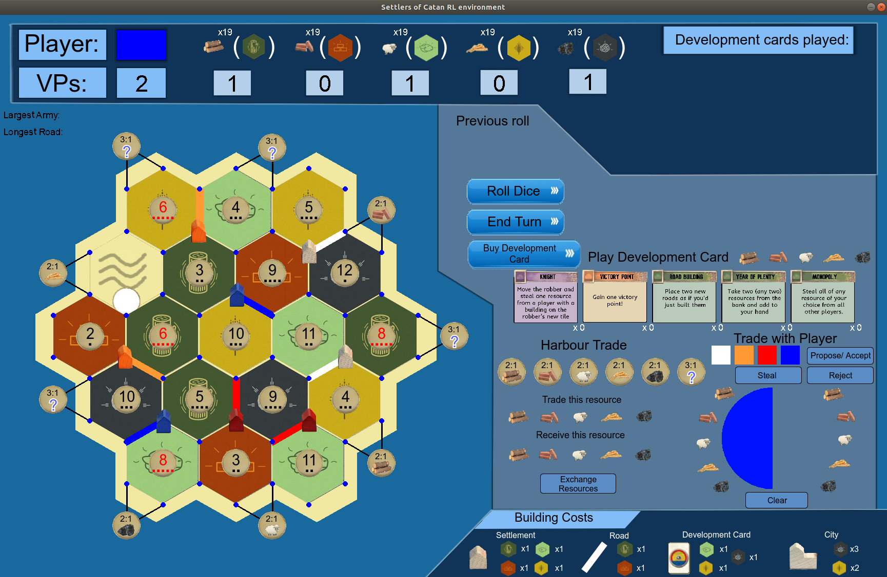

# Learning To Play "Settlers of Catan" With Deep Reinforcement Learning

A custom simulator written in Python and designed with RL in mind. Also included is an implementation of PPO that can be used to train an agent to play, as well as a "forward search" agent that uses the trained RL agent for planning.

Main dependencies are:

`pygame>=2.5.2`
`numpy>=1.24.0`
`torch>=2.0.0`
`stable-baselines3>=2.0.0`
`scipy>=1.10.0`

Install with `pip install -e .`

Pre-trained agent is included in RL/results. Not quite at the level of a good human, but can still be fun to play against.
To launch an interactive game run:

`python play.py`

which will give you a game where you control all players. To play against three copies of the RL agent:

`python play.py --policy1 "human" --policy2 "RL_3825" --policy3 "RL_3825" --policy4 "RL_3825"`

here 3825 refers to the file "default_after_update_3825.pt" included in RL/results. In general if you run training the agent
should be saved at regular intervals and you could change 3825 to the number of updates the agent has been trained for.

To play against three "forward search" agents:

`python play.py --policy1 "human" --policy2 "forward_search_3825" --policy3 "forward_search_3825" --policy4 "forward_search_3825"`

where here the forward search agent will be built on top of the RL policy after 3825 updates. There are other arguments that can be
configured for the forward search agent as well - ideally you want to set `--num-processes` to as many CPU cores as you have available,
and `--thinking-time` can also be configured to choose how long the agent can spend on each decision (note that by default they are given extra time for the initial placement phase).



To train an agent from scratch (which will take a long time - the pretrained agent was ran for ~1 month on a 32-core machine with a GTX3090 GPU), run:

`python RL/robust_train.py`

Note that the arguments to configure the experiment can be found in RL/ppo/arguments.py.

---

## macOS-Specific Tips

- **Retina Display Support:** For sharper graphics on Retina displays, add this at the top of your main script (before importing pygame):
  ```python
  import os
  os.environ['SDL_HINT_VIDEO_HIGHDPI_DISABLED'] = '0'
  ```
- **Font Issues:** If you see missing or strange fonts, consider using a bundled .ttf font file and load it with `pygame.font.Font("path/to/font.ttf", size)`.
- **Menu Bar/Focus Issues:** If the window is hidden or unresponsive, try adding this before importing pygame:
  ```python
  import os
  os.environ['SDL_VIDEO_MAC_FULLSCREEN_SPACES'] = '1'
  ```
- **No Display/Video System Not Initialized:** Make sure you are running from a regular Terminal, not from IDLE/Jupyter. If you are using SSH, you need X11 forwarding or a virtual display.
- **Apple Silicon (M1/M2):** The project will automatically use the MPS backend for PyTorch if available.
- **Audio:** If you want to use audio, ensure your Mac's audio output is set up and `pygame.mixer` is initialized.

If you encounter any issues specific to macOS, please refer to the above tips or open an issue.
